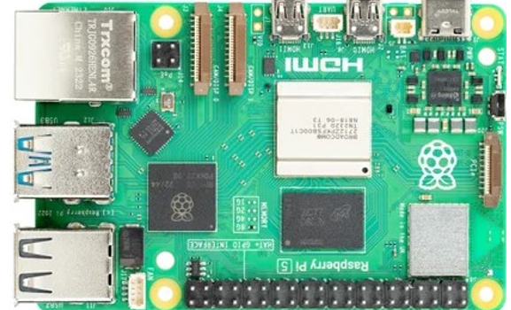
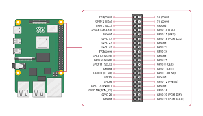

# GPIOZero Library Connection for Electronic and Electrical Components

This repository contains a collection of reusable code snippets integrating the `gpiozero` library with various electronic and electrical components. While primarily tested on the Raspberry Pi 5 Model B+, the code is expected to be compatible with other models as well.

## How to Hold Your Raspberry Pi for Listening to Instructions

![Raspberry Pi Handling]

Ensure to hold your Raspberry Pi in this manner while following instructions regarding circuit creation.

## GPIO Pin Configuration Guide

![GPIO Pin Configuration]

Refer to this GPIO pin configuration guide in case of conflicts or unavailability of specific pins for smooth integration.

## Usage

The repository is organized into folders categorizing different components and project functionalities. Each folder contains code snippets demonstrating the use of `gpiozero` library with specific components.

### Compatibility

The code has been tested on Raspberry Pi 5 Model B+ and expected to work with other Raspberry Pi models.

## License

This repository is licensed under the [MIT License](link_to_license).
